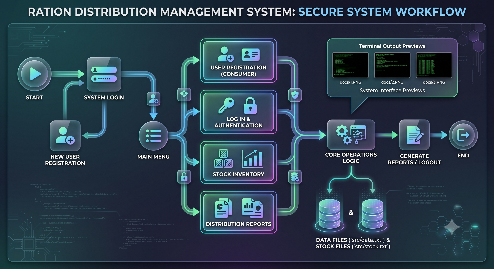
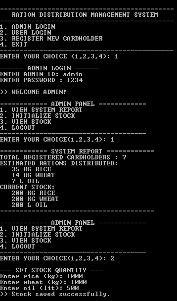
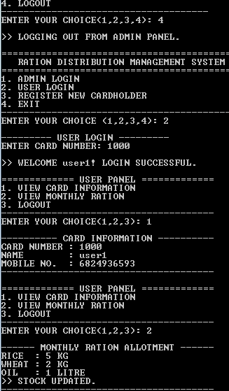
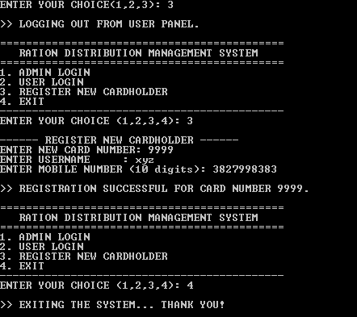

# Ration Distribution Management System

A modular, console-based inventory and distribution management system implemented in C. Designed for tracking public ration quotas, consumer records, inventory balances, and automated reporting.

---

## 📌 System Architecture & Workflow

<div align="center">
  
</div>

---

## 🖥️ Terminal Interface Previews

| Registration & Login | Stock Management | Distribution Records |
| :---: | :---: | :---: |
|  |  |  |

---

## 📁 Repository Structure

```text
├── docs/
│   ├── workflow-architecture.png                 # System flowchart & architecture diagram
│   ├── 1.PNG                                     # Terminal output preview 1
│   ├── 2.PNG                                     # Terminal output preview 2
│   ├── 3.PNG                                     # Terminal output preview 3
│   ├── PROJECT(Ration Distribution...).pdf       # Complete project documentation & report
│   └── work flow_ration distribution system.png  # Base logical schema
│   └── workflow-architecture.png                 # Base logical schema (edited with AI)
└── src/
    ├── main.c                                    # Core driver program & navigation menu
    ├── login.c                                   # Authentication & access control
    ├── register.c                                # Citizen / consumer record management
    ├── stock.c                                   # Commodity allocation & stock updates
    ├── report.c                                  # Distribution metrics & file reporting
    ├── data.txt                                  # Flat-file database: Consumer data
    ├── stock.txt                                 # Flat-file database: Commodity records
    └── Ration Distribution Management System.cbp # Code::Blocks workspace project file
